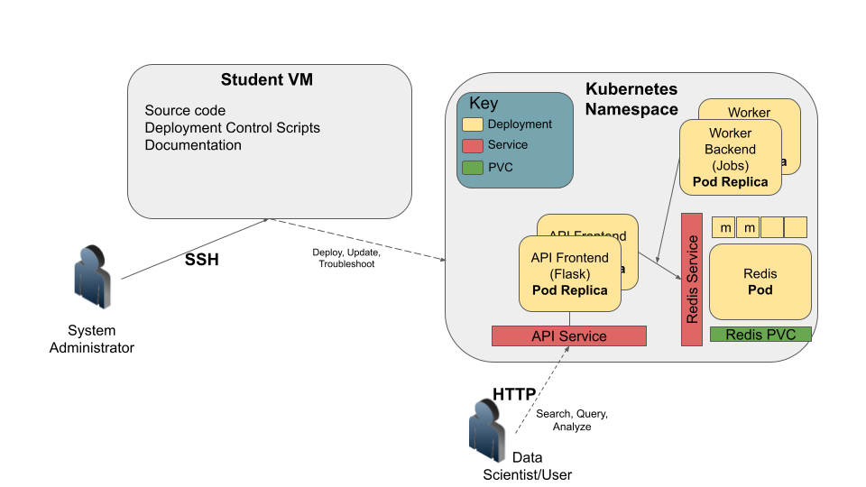
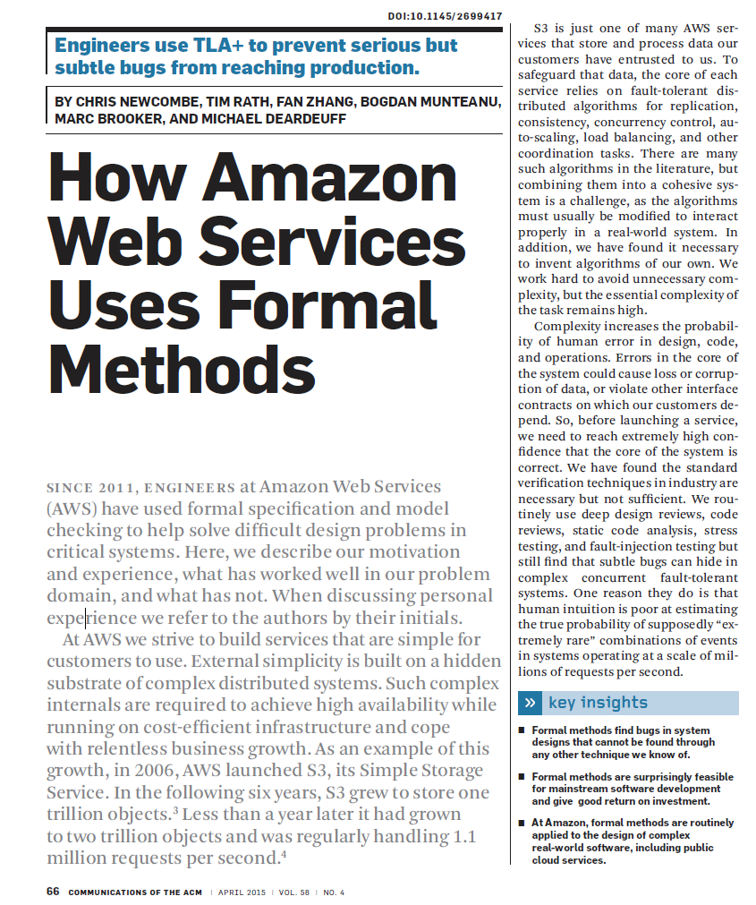

Introduction to Software Design
===============================

In this section, we introduce the topic of Software Design. There are many aspects and concepts related to Software Design --
many more than can be covered in a single semester -- and indeed, the topics we present throughout the 
rest of the semester will be, at least in part, aimed at tackling one or more aspects of design. Here, we simply provide 
a high-level overview of the Software Design landscape.

Software Design as a Process
-----------------------------
On the one hand, designing software is a process involving different types of people -- architects, developers, project managers, 
funding groups, etc. -- and there are different paradigms, methodologies and frameworks for guiding this process. 

Here are just a few examples: 

* Waterfall Method -- Software tasks are organized into sets or "phases" with a linear ordering; tasks from each phase are
  completed before moving to the next phase. In practice, phases tended to be longer (on the order of weeks or months) for
  larger projects that could span years. 
* Agile Method-- In contrast to Waterfall, Agile advocates smaller, complete software development life cycles, where "minimal"
  products are released and then incrementally improved. 
* Test Driven Development -- Developers write tests asserting what the software should do before writing any software. 
  Initially, all the tests fail, but as the software gets closer to completion and more functionality is developed, 
  the tests increasingly pass. 

We will not focus a whole lot on Software Design as a process, and, in particular, we will not discuss any of the specific 
methodologies or frameworks in depth. We will, however, introduce some common phases, such as requirements gathering, 
architectural design, acceptance testing, etc. 

Software Design Principles
--------------------------
Another way to think of Software Design is as a set of principles and associated techniques for achieving software with
certain qualities. In this class, we will be mostly focusing on Software Design principles. 

Throughout the course of the semester we will discuss techniques that help achieve the following Software Design principles:

#1: Modularity
~~~~~~~~~~~~~~
Modularity involves dividing the components of software into parts. There are two principles that guide how we 
decompose software:

Intra-Module Cohesion
^^^^^^^^^^^^^^^^^^^^^
Cohesion refers to the similarity of the elements contained within a component (or "module"). When designing software,
we strive to *increase* cohesion within a module. That is, we want to group similar functionality together. This can be 
at a low-level or at a high-level.

For example, thinking at a "low level", we want to group together Python functions, variables, etc. into modules and 
packages based on functionality. We've already seen examples of this from the Python standard library: the ``json`` module
collects Python code related to working with JSON data.

At a higher level, as the class progresses we will be developing multiple individual programs that integrate together to 
form a complete system. These individual programs focus on specific tasks, providing good cohesion.

Inter-Module Coupling
^^^^^^^^^^^^^^^^^^^^^
Coupling refers to the degree to which two components depend on each other. There are several ways to formalize the notion of 
coupling and make it something one can measure. For example, given components A and B, we can ask:

 * If component A changes, to what extent must component B change for component B to continue to function?
 * If component A fails, to what extent can component B continue to function? 
 * For each piece of functionality in component A, when executing that function, how many pieces of functionality in component B 
   execute? 

According to the design principle, we want to *reduce* inter-module coupling (sometimes called "loose coupling"). Reduced coupling
allows different parts of the software to be modified independently and created more robust software. 

#2: Abstraction
~~~~~~~~~~~~~~~
You likely already know the concept of abstraction from math and science courses. The real world is very complicated.
With abstraction, we replace an exact concept with a simplified model. For example, the Bohr model is an abstraction of the actual atom. 

You have seen examples of abstractions in software also. For instance, we saw how the Python function ``open()`` returns
a "file object" (cf., https://docs.python.org/3/glossary.html#term-file-object). A file object is an abstraction representing
data stored in different formats. With a file object, you can do certain actions, represented by functions, e.g.,:

* Read data from the file object.
* Write data to the file object.

Note that when dealing with an actual file stored on a hard drive, the individual bytes are organized into blocks and sectors. 
These details and others are hidden from us when we use Python's file object abstraction, which makes it much easier to use. 
It also allows the file object to be used for other kinds of data storage, as we'll see in the next section. 

#3: Generalization
~~~~~~~~~~~~~~~~~~
Generalization allows the same software component to be used in different situations. It improves the reusability of software.

Generalization and Abstraction go hand and hand: using well-designed abstractions allows the same model to be used in many 
places. Continuing with the example above, it turns out that we can use the same file objects to handle data from a lot 
of different sources, including:

* Actual files stored on the hard drive
* Standard input and output 
* In-memory buffers 
* Sockets 
* Unix pipes 

And more! That illustrates the power of abstraction: by learning just a few concepts and functions (e.g., ``open``, 
``read``, ``write``, etc.) one is able to deal with all of these different kinds of data sources!

#4: Portability and Reproducibility
~~~~~~~~~~~~~~~~~~~~~~~~~~~~~~~~~~~
The last design principle we will mention is that of software portability and the related concept of reproducibility. 
Portability refers to the ability to access and execute software from different kinds of computers, while reproducibility
means that the results obtained from executing the software at one time can be obtained later. We will spend a significant
amount of time this semester working with techniques that improve the portability of the software we develop.

Software Design Goals for COE 332
---------------------------------
During the course of the semester, you will build a large (by some measure), distributed sofware 
system for data analysis. Your system will comprise many components and thousands of lines of code. An
example illustration of a typical final class project is shown below, to give an indication of where we 
are headed.

As we add components and complexity, these software design principles will become increasingly important.

Our goals for COE 332 are to illustrate these design concepts so that you can recognize them and apply them,
not just towards the design of distributed systems and/or data analysis, but all kinds of different software.
While in this course we'll illustrate these principles in the context of distributed systems, they are
broadly applicable to all large software projects. 

Static Analysis Tools Like Pylint
----------------------------------

Pylint is a tool for statically analyzing your code. It can identify changes you can make to 
improve the overall quality of your software.

Install pylint on the student VM:

.. code-block:: console

  [coe332-vm]$ sudo pip3 install pylint

The basic usage of pylint is from the command line: 

.. code-block:: console

  [coe332-vm]$ pylint /path/to/file

or

.. code-block:: console

  [coe332-vm]$ pylint /path/to/package

Let's try this with the ``json`` module and package from the standard library? 
As an aside, does anyone know how we would find the path to the package? 

.. code-block:: python 

  >>> import json 
  >>> json.__file__ 
  --> '/usr/lib/python3.12/json/__init__.py'   

We can call pylint on the specific file: 

.. code-block:: console

  [coe332-vm]$ pylint /usr/lib/python3.12/json/__init__.py
  

or on the entire package: 

.. code-block:: console

  [coe332-vm]$ pylint /usr/lib/python3.12/json
  

We get output messages like the following: 

.. code-block:: console 

      ************* Module json
  /usr/lib/python3.12/json/__init__.py:120:0: R0913: Too many arguments (11/5) (too-many-arguments)
  /usr/lib/python3.12/json/__init__.py:165:8: R0916: Too many boolean expressions in if statement (10/5) (too-many-boolean-expressions)
  /usr/lib/python3.12/json/__init__.py:183:0: R0913: Too many arguments (10/5) (too-many-arguments)
  /usr/lib/python3.12/json/__init__.py:227:8: R0916: Too many boolean expressions in if statement (10/5) (too-many-boolean-expressions)
  /usr/lib/python3.12/json/__init__.py:244:0: C0116: Missing function or method docstring (missing-function-docstring)
  . . . 

  ------------------------------------------------------------------
  Your code has been rated at 8.46/10 (previous run: 8.46/10, +0.00)

Pylint generates the following Message Types:

* [I]nformational messages that Pylint emits (do not contribute to your analysis score)
* [R]efactor for a "good practice" metric violation
* [C]onvention for coding standard violation
* [W]arning for stylistic problems, or minor programming issues
* [E]rror for important programming issues (i.e. most probably bug)
* [F]atal for errors which prevented further processing

It also generates a score, at the bottom, and tracks the changes in the score over time. You can 
also pass ``--reports=y`` to generate a set of metrics, e.g., 

.. code-block:: condole

  pylint /usr/lib/python3.12/json/__init__.py --reports=y

  Report
  ======
  65 statements analysed.

  Statistics by type
  ------------------

  +---------+-------+-----------+-----------+------------+---------+
  |type     |number |old number |difference |%documented |%badname |
  +=========+=======+===========+===========+============+=========+
  |module   |1      |1          |=          |100.00      |0.00     |
  +---------+-------+-----------+-----------+------------+---------+
  |class    |0      |NC         |NC         |0           |0        |
  +---------+-------+-----------+-----------+------------+---------+
  |method   |0      |NC         |NC         |0           |0        |
  +---------+-------+-----------+-----------+------------+---------+
  |function |5      |5          |=          |80.00       |0.00     |
  +---------+-------+-----------+-----------+------------+---------+

  . . . 

.. note:: 

  Pylint and other linters analyze the *implementation* not the design. 

Tools For Analyzing Designs 
----------------------------

Tools for analyzing designs themselves are an active area of computer science and software engineering 
research. One approach makes use of a *specification language*, a formal language similar to a programming
language to define the design/specification fo the system. 

TLA+ 
~~~~
One particular specification language that has been around for a while but has recently gained some 
traction in industry is TLA+. To use TLA+, one writes a *specification* of the system being designed. 
The specification makes use of variables, constants, and functions, similar to a programming language, 
but it also allows one to define *invariants*, which are mathematically precise statements about 
the design that should always be true. 

.. code-block:: console 

  # example of a variable 
  WorkerState == {"-","IDLE", "BUSY","FINISHED", "SHUTDOWN_REQUESTED", "DELETED"}
  . . . 

  # example of a function; changes state of the design: 
  ExecuteRecv(msg, a) ==    
      /\  actorStatus[a]= "READY" \/ actorStatus[a]= "UPDATING_IMAGE"
      /\  msg.type = "EXECUTE"
      /\  msg.actor = a
      /\  tmsg < MaxMessage  

  # example of an invariant; something that should always be true 
  AllWorkersOfActorUseSameImageVersion == \A a \in Actors: \A x, y \in actorWorkers[a]:
    currentImageVersionForWorkers[x] = currentImageVersionForWorkers[y]  

TLA+ can then be used to either: 1) explore a fixed (i.e., finite) state space to determine if the 
invariants hold for all possible state transitions; or 2) furnish mathematical proofs that the invariants 
hold *for all* values in the state space (which is usually infinite). 

Use of TLA+ in AWS
~~~~~~~~~~~~~~~~~~

AWS has used TLA+ for more than a decade on critical services such as their DynamoDB and S3 services. 

    
    Paper on Amazon's use of TLA+ and other formal methods.

Key Insights: 

 * Formal methods find bugs in system designs that cannot be found through any other technique they know of.
 * Formal methods are surprisingly feasible for mainstream software development and give a good return 
   on investment.
 * At Amazon, formal methods are routinely applied to the design of sophisticated real-world software, 
   including public cloud services.

Downsides of TLA+ and Formal Methods 
~~~~~~~~~~~~~~~~~~~~~~~~~~~~~~~~~~~~~

The primary downsides of using formal method systems like TLA+ are: 

1. Formal Methods systems are complex, usually requiring learning a new language which has a 
   different flavor from more mainstream languages such as Python, Rust or JavaScript. 
2. Formal Methods systems require keeping an entirely separate design definition up to date
   in addition to the actual software. 
3. Even if one is able to validate the design specification, the actual implementation could 
   be different. 